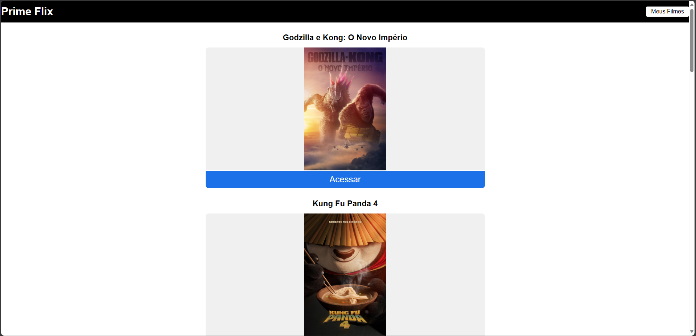
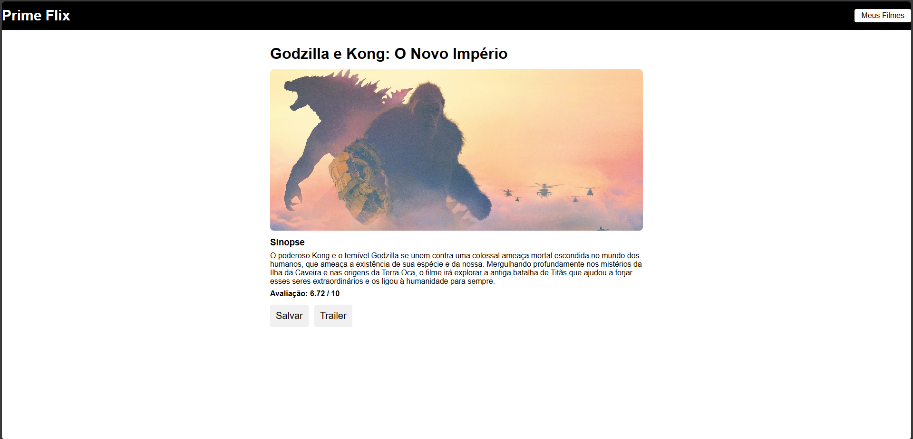
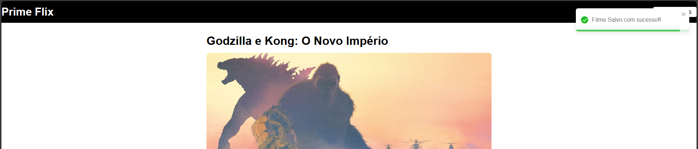
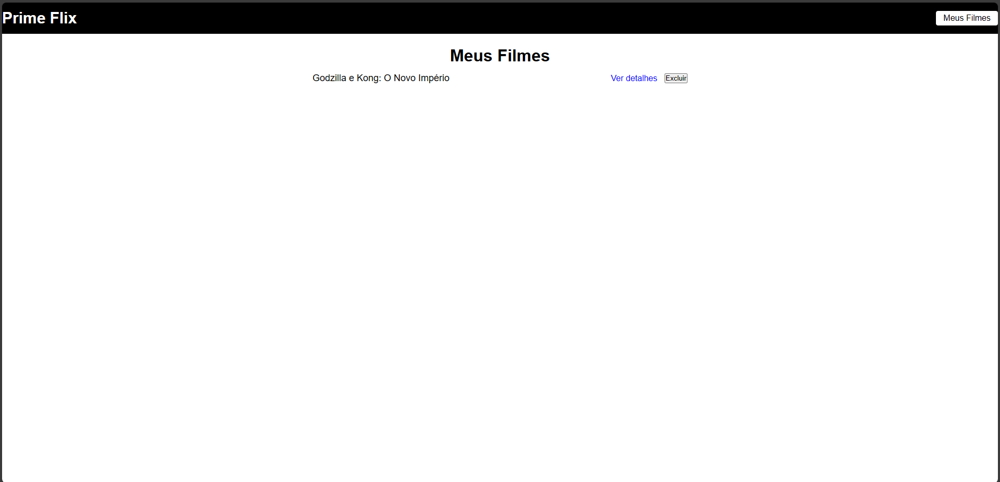
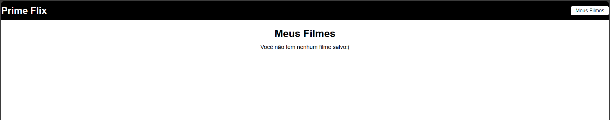
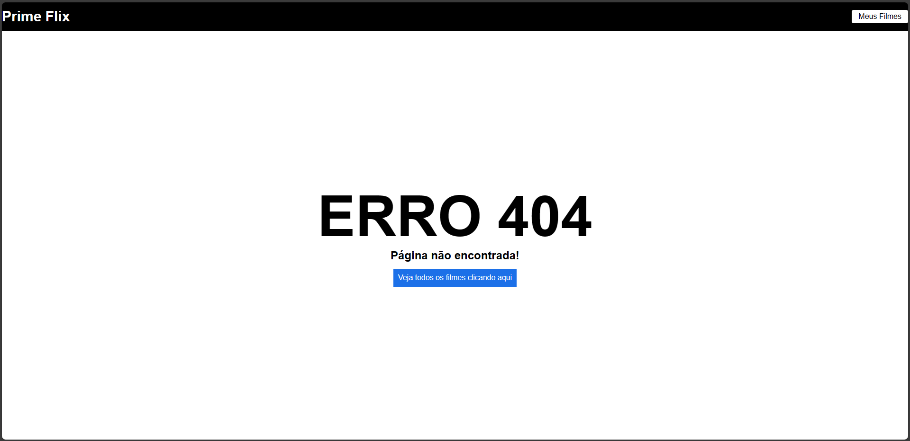

# PrimeFlix - Uma aplicação de filmes

## Descrição

PrimeFlix é uma aplicação web que permite aos usuários explorar e salvar seus filmes favoritos. Os usuários podem visualizar detalhes dos filmes, assistir aos trailers e salvar filmes em uma lista de favoritos para acessá-los posteriormente.

## Tecnologias Utilizadas

- **React**: Biblioteca JavaScript para construção da interface de usuário.
- **React Router**: Biblioteca para controle de rotas na aplicação.
- **Axios**: Cliente HTTP para fazer requisições à API de filmes.
- **react-toastify**: Componente para exibir notificações na aplicação.
- **HTML**: Linguagem de marcação para estruturação do conteúdo da aplicação.
- **CSS**: Linguagem de estilo para estilização dos componentes.
- **localStorage**: Armazenamento local do navegador para salvar filmes favoritos do usuário.

## Instalação

1. Clone o repositório do GitHub para sua máquina local:
   ```
   git clone https://github.com/seu-usuario/primeflix.git
   ```
   
2. Acesse o diretório do projeto:
   ```
   cd primeflix
   ```
   
3. Instale as dependências do projeto utilizando npm:
   ```
   npm install
   ```
   
   Certifique-se de adicionar as dependências necessárias utilizando o seguinte comando:
   ```bash
   npm install axios react-router-dom react-toastify
   ```

## Uso

1. Inicie a aplicação em ambiente de desenvolvimento:
   ```
   npm start
   ```

2. Acesse a aplicação em seu navegador web utilizando o seguinte endereço:
   ```
   http://localhost:3000
   ```

## Funcionalidades

- **Explorar filmes em exibição**: Na página inicial, o usuário pode visualizar uma lista de filmes em exibição.
- **Detalhes do filme**: Ao clicar em um filme, o usuário é direcionado para uma página com os detalhes do filme, incluindo sinopse, avaliação e opção para assistir ao trailer.
- **Salvar filmes favoritos**: O usuário pode salvar filmes em uma lista de favoritos clicando no botão "Salvar" na página de detalhes do filme.
- **Visualizar filmes favoritos**: Na página "Meus Filmes", o usuário pode visualizar todos os filmes salvos em sua lista de favoritos.
- **Excluir filmes favoritos**: O usuário pode remover filmes da lista de favoritos clicando no botão "Excluir" na página "Meus Filmes".


## Prints da Aplicação













## Acesso Online

A aplicação está disponível online através do seguinte link: [PrimeFlix](https://prime-flix-topaz.vercel.app/)

---